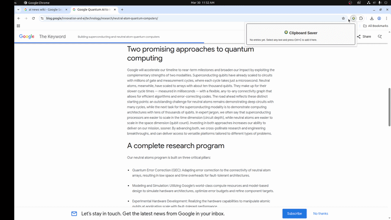

# Clipboard Saver — Effortless Ctrl+C Grabber for Chrome

A Chrome extension that makes saving copied text effortless. With a simple **Ctrl+C**, every selection becomes a new clipboard entry you can edit, and export anytime as TXT or CSV.

<p align="center"><br/></p>

## Why This Exists (Inspiration)

I often needed to copy information from websites and manually paste it into CSV files, Word documents, or other apps. Handling many items across multiple sites quickly became tedious (Ctrl+C then Ctrl+V). Hence, I built Clipboard Saver to make saving copied text effortless.

### Features

- **Effortless Saving:** Press `Ctrl+C` to instantly save any copied text as a new entry.  
- **Search:** Quickly find past entries with the built-in search bar.  
- **Edit Entries:** Double-click an entry to update its content.  
- **Download History:** Download your clipboard as TXT or CSV for backup or sharing.  
- **Lightweight & Secure:** All data is stored locally in Chrome, no external servers.  

### How It Works

1. Select any text as usual from any website.
2. Press `Ctrl+C` to add it as a new entry in the extension.
3. Access your history via the popup, search, edit, or export whenever needed.

## Installation

Clipboard Saver is not on the Chrome Web Store. You install it manually by loading the source code directly. This takes about a minute.

### Step 1: Download the Extension

**Option A - Clone with Git:**  

```bash
git clone https://github.com/tejasashinde/clipboard-saver-extension
```

**Option B - Download ZIP:**

1. Download the latest release ZIP from this repository. 
2. Extract the zip to a folder on your computer (e.g., ~/clipboard-saver).

### Step 2: Open Chrome Extensions Page

1. Open Chrome.
2. Type `chrome://extensions` in the address bar and press Enter.
3. Enable Developer mode using the toggle in the top-right corner.

### Step 3: Load the Extension

1. Click Load unpacked in the top-left.
2. Navigate to the clipboard-saver folder you downloaded.
3. Select the folder (the one containing manifest.json) and click Open.
The Clipboard Saver icon should appear in your browser toolbar. If it's hidden, click the puzzle piece icon in the toolbar and pin Clipboard Saver.

### Step 4: Start Grabbing Text

1. Copy any text using `Ctrl+C` in .
2. Open the Clipboard Saver popup to see your entries, edit, or download them.


## Updating

If you pull or download a new version, go to `chrome://extensions` and click the Reload button on the Clipboard Saver card, or just click Load unpacked again and select the same folder.

## Uninstalling

Go to `chrome://extensions`, find Clipboard Saver, and click Remove.

## Contributing

Contributions are welcome! Feel free to open issues or submit pull requests for new features, bug fixes, or improvements.

## License

MIT License — see the [LICENSE](LICENSE) file for details.